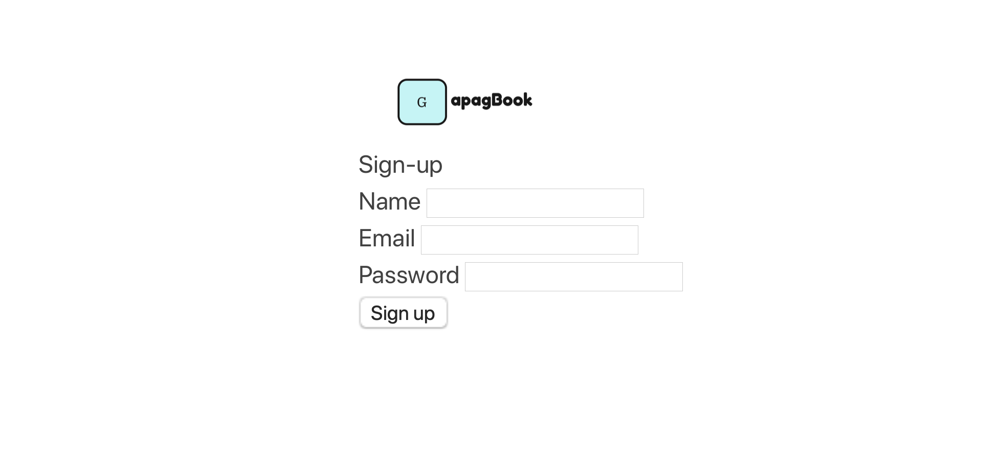

# GAPAGbook 

https://gapag1.herokuapp.com/

This project is part of weeks 8 and 9 of Makers Academy. The focus of the project was to practice AGILE methodologies and ceromonies, such as standups and sprint planning sessions, as well as learning Ruby on Rails along the way.

Project requirements were specified by Makers coaches who acted as the client. We were given a set of requirements at the start of the first week and again in the second week.

## Team Members
- [Gina Frankel](https://github.com/Gina-Frankel)
- [Alexa Kearns](https://github.com/alexakearns)
- [Phil Vigus](https://github.com/PhilipVigus)
- [Alex Lewis](https://github.com/AlexLewis10)
- [Graham Falconer](https://github.com/grahamfalconer)

## Technologies

| Purpose       | Technology     | 
| ------------- |:-------------: | 
| Framework     | Rails          |
| Language      | Ruby 2.5.0     | 
| Test framework| Rspec, Capybara|
| CI/CD         | Travis         |
| Hosting       | Heroku         |
| Databases     | postgresql     |
| Encryption    | Bcrypt         |
| Codequality   | Rubocop, SimpleCov, Rubycritic |

## User Stories

**Week 1**
```
As a user,
So that I can make posts securely,
I would like to be able to sign up with a unique username, email and password

As an signed up user,
So that I can sign in,
I would like a login page where I enter my email address and password.

As a user,
When signing in, if I enter incorrect details,
I would like to recieve a prompt to enter my details again

As a user,
So I can give updates about my life,
I would like to make posts on my wall

As a user,
If I want to change a post,
I can either update or delete a post

As a user, 
So I can understand other people's posts better,
I would like to be able to see who made the post and at what time

As a user,
I want my friends to be able to see my news,
I would like my newest posts to appear first

As a user,
So that I can see what eveeryone has been doing
I would like to be able to see all posts in one page

```
**Week 2**
```
As a user, 
So when I login I see my posts, 
I would like to be redirected to my wall

As a user, 
So that strangers cant see my posts as a security feature,  
I would like only logged in users to see posts

As a user, 
So that everything I’ve posted can appear in one place, 
I would like to have my own wall.

As a user, 
So that I have full control over my posts, 
As the owner of posts, onIy I, can update or delete them 

As a user, 
So that I can see all my friends posts in one place, 
I would like to click on a friends user handle and be directed to their wall 

As a user,  
So that I can post on my friends wall,  
I would like to be able to post on my friends wall
```

## Further Requirements

- The project should be hosted online so that everyone can visit the website.
- The project should have CI/CD.
- To ensure code quality, test coverage should be over 90% and have code quality and code style checks


### Mockup  


### Tables 


### Styling 



## Quickstart


## How to install and run it.
First, clone this repository. Then:

```bash
> bundle install
> bin/rails db:create
> bin/rails db:migrate
> bundle exec rspec # Run the tests to ensure it works
> bin/rails server # Start the server at localhost:3000
```
Further info on using Travis and Heroku are in the wiki

You may also need to install postgresql on your machine. On your command line;

```
$ brew install postgresql
$ brew services start postgresql
```

## How to run tests  
- rspec 
  - run `rspec`
- simplecov 
  - connected to rspec
- rubocop 
  - run `rubocop`
- rubycritic 
  - run `rubocritic`


